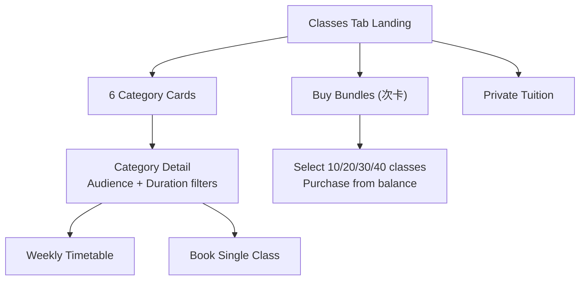

# DanceStudioApp Feature Expansion

## 1. Internationalization (i18n) -- Chinese/English Toggle

**Approach:** Add `expo-localization` + `i18next` + `react-i18next` for translation support.

- Create translation files: `src/i18n/en.json` and `src/i18n/zh.json` with all UI strings (screen titles, buttons, labels, dance type names, etc.)
- Create `src/i18n/index.js` to configure i18next with device-locale detection and manual override
- Create `src/context/LanguageContext.js` to store user's language preference in AsyncStorage and expose `locale` / `setLocale`
- Wrap the app in `LanguageProvider` in [app/_layout.js](DanceStudioApp/app/_layout.js)
- Add a language toggle in [app/(tabs)/profile.js](DanceStudioApp/app/(tabs)/profile.js) (simple "EN / 中文" segmented control)
- Replace all hardcoded strings across screens with `t('key')` calls
- Currency display: always `A$` (AUD) regardless of language

## 2. Database Schema Changes (Supabase Migration)

New migration file: `supabase/migrations/20260218000000_classes_expansion.sql`

### Current state

Class type is currently a **free-text** `class_type` column on the `CLASSES` table (line 10 of existing migration). Bookings are in `enrollments` (user_id + class_id, no status). Purchase history is in `transactions` (type: topup/purchase/refund). Cancellations are **not supported**.

### New tables

- **`class_categories`** -- the 6 dance types (replaces free-text `class_type`)
  - `id` (uuid PK), `key` (text unique, e.g. `chinese_classical`), `name_en` (text), `name_zh` (text), `icon` (text, optional emoji/icon name), `has_children` (boolean, false for Miscellaneous), `sort_order` (int)
  - Seeded with: 中国舞, 芭蕾, 街舞, 青少年 K-pop, 韩舞, 其他

- **`class_timetable`** -- recurring weekly schedule (admin-managed in Supabase Dashboard)
  - `id` (uuid PK), `category_id` (uuid FK -> class_categories), `audience` (text: 'adult' or 'children'), `day_of_week` (int 0-6), `start_time` (time), `duration_minutes` (int: 60 or 90), `instructor` (text), `room` (text), `price_per_class` (numeric), `is_active` (boolean default true), `created_at`, `updated_at`

- **`class_bundles`** -- purchasable bundles (次卡)
  - `id` (uuid PK), `category_id` (uuid FK, nullable -- null means any category), `audience` (text, nullable), `class_count` (int: 10/20/30/40), `expiry_weeks` (int: 10/20/30/40), `total_price` (numeric), `is_active` (boolean), `created_at`

- **`user_bundles`** -- purchased bundles per user
  - `id` (uuid PK), `user_id` (uuid FK -> auth.users), `bundle_id` (uuid FK -> class_bundles), `category_id` (uuid FK), `audience` (text), `classes_remaining` (int), `purchased_at` (timestamp), `expires_at` (timestamp), `is_active` (boolean)

- **`private_tuition_requests`** -- private lesson requests
  - `id` (uuid PK), `user_id` (uuid FK), `category_id` (uuid FK), `preferred_date` (date), `preferred_time` (time), `duration_minutes` (int), `notes` (text), `status` (text: 'pending'/'confirmed'/'cancelled'), `created_at`

### Alter existing tables

- **`CLASSES`**: Add `category_id` (uuid FK -> class_categories), `audience` (text), `duration_minutes` (int). Keep `class_type` for backward compat but new code uses `category_id`.

- **`enrollments`**: Add `status` (text: 'active'/'cancelled', default 'active'), `cancelled_at` (timestamptz, nullable), `bundle_id` (uuid FK -> user_bundles, nullable -- set when booked via bundle). This enables soft-delete cancellations with audit trail.

### Booking / cancellation / purchase flow

- **Booking a single class**: Insert into `enrollments` (status='active'), deduct from balance, insert `transactions` (type='purchase').
- **Booking via bundle**: Insert into `enrollments` (status='active', bundle_id set), decrement `user_bundles.classes_remaining`. No balance deduction.
- **Cancellation**: Update `enrollments` SET status='cancelled', cancelled_at=now(). If paid via balance, insert `transactions` (type='refund') and restore balance. If paid via bundle, increment `user_bundles.classes_remaining`.
- **Bundle purchase**: New RPC `purchase_bundle(p_bundle_id)` that atomically deducts balance, creates `user_bundles` row, and logs `transactions` (type='purchase').
- **Purchase history**: `transactions` table already tracks all flows (topup, purchase, refund). Add `bundle_id` column (uuid FK, nullable) so bundle purchases are linked.

### RLS policies

All new tables follow the existing pattern: users see their own data; public read on `class_categories`, `class_timetable`, `class_bundles`.

## 3. Redesigned Classes Module -- Floating Cards

Replace the current [app/(tabs)/classes/browse.js](DanceStudioApp/app/(tabs)/classes/browse.js) and update [app/(tabs)/classes/index.js](DanceStudioApp/app/(tabs)/classes/index.js).

**New screen flow:**

All three options (category cards, Buy Bundles, Private Tuition) appear as peer-level cards on the Classes tab landing page.

**New/modified files:**

- **`app/(tabs)/classes/index.js`** -- Landing page with three sections as floating cards at the same level:
  - 6 dance category cards (2-column grid). Each shows Chinese name (large), English name (subtitle), upcoming class count.
  - "Buy Bundles / 次卡" card -- prominent, same visual weight as category cards.
  - "Private Tuition" card -- at the bottom.
  - Minimalist style: white cards, soft shadow, rounded corners (existing `borderRadius.xl`).

- **`app/(tabs)/classes/[categoryId].js`** -- Category detail screen (new file, dynamic route)
  - Audience toggle: "Adult / Children" segmented control (hidden for Miscellaneous)
  - Duration filter: "1 hr / 1.5 hr" pills
  - Weekly timetable pulled from `class_timetable` table, rendered as a clean day-by-day list
  - List of upcoming scheduled `CLASSES` for this category, with "Book" action
  - Cancel class option on enrolled classes (soft-delete + refund flow)

- **`app/(tabs)/classes/bundles.js`** -- Bundle purchase screen (new file)
  - Shows available bundles (10/20/30/40 classes) with price, expiry, and per-class cost
  - Clean card layout, one card per option
  - Optional category filter (buy bundle for specific dance type or general)
  - Purchase deducts from balance via `purchase_bundle` RPC
  - Creates entry in `user_bundles`

- **`app/(tabs)/classes/private.js`** -- Private tuition request form (new file)
  - Category picker, date picker, time picker, duration, notes
  - Submits to `private_tuition_requests`
  - Confirmation message on success

- **`app/(tabs)/classes/_layout.js`** -- Update stack to include new routes (`[categoryId]`, `bundles`, `private`)

## 4. New Components

- **`src/components/CategoryCard.js`** -- Floating card for each dance category. Props: `category`, `classCount`, `onPress`. Minimalist: white bg, soft shadow, Chinese name prominent, English subtitle.

- **`src/components/TimetableView.js`** -- Weekly timetable display. Props: `schedules`, `onBookClass`. Shows days as sections, time slots as rows.

- **`src/components/BundleCard.js`** -- Bundle option card. Props: `bundle`, `onPurchase`. Shows class count, price, expiry in a clean layout.

- **`src/components/AudienceToggle.js`** -- Reusable "Adult / Children" segmented control.

## 5. Update Existing Screens

- **Home screen** [app/(tabs)/index.js](DanceStudioApp/app/(tabs)/index.js): Add "My Bundles" summary card showing active bundles and remaining classes. Update currency to `A$`.

- **Profile screen** [app/(tabs)/profile.js](DanceStudioApp/app/(tabs)/profile.js): Add language toggle (EN/中文). Add "My Bundles" section.

- **Balance screen** [app/(tabs)/balance.js](DanceStudioApp/app/(tabs)/balance.js): Change currency display to `A$`.

- **Cart screen** [app/(tabs)/cart.js](DanceStudioApp/app/(tabs)/cart.js): Change currency to `A$`. Support booking via bundle (deduct from `classes_remaining` instead of balance if user has an active bundle for that category).

- **All screens**: Replace hardcoded English strings with `t()` translation calls.

## 6. Design Rules

- Minimalist, clean and tidy throughout
- Existing color palette preserved (primary `#18181b`, accent `#C5896E`, bg `#FAFAFA`)
- Floating cards: white background, `borderRadius.xl`, `shadows.soft`
- Chinese text rendered in the same font (system default handles CJK)
- No unnecessary decoration; generous whitespace
